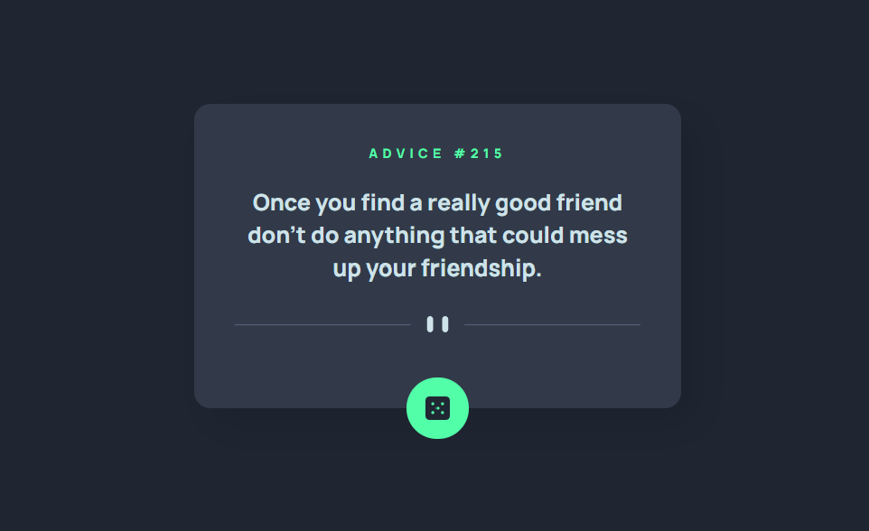

# Frontend Mentor - Advice generator app solution

This is a solution to the [Advice generator app challenge on Frontend Mentor](https://www.frontendmentor.io/challenges/advice-generator-app-QdUG-13db). Frontend Mentor challenges help you improve your coding skills by building realistic projects.

## Table of contents

- [Overview](#overview)
  - [The challenge](#the-challenge)
  - [Screenshot](#screenshot)
  - [Links](#links)
- [My process](#my-process)
  - [Built with](#built-with)
  - [What I learned](#what-i-learned)
  - [Useful resources](#useful-resources)
- [Author](#author)

## Overview

### The challenge

Users should be able to:

- View the optimal layout for the app depending on their device's screen size
- See hover states for all interactive elements on the page
- Generate a new piece of advice by clicking the dice icon

### Screenshot



### Links

- Solution URL: [Hosted on github pages](#)

## My process

### Built with

- Semantic HTML5 markup
- CSS
- JavaScript

### What I learned

It was fun incorporating JavaScript into my project. Initially, I was testing out my site in firefox, where the advice would not reset and randomise due to the `.fetch()` command accessing the cache. To combat this, i changed some of the optional settings for the command:

```js
function get(url) {
  /* optional settings have to be passed in as an object, I only chose to change how the fetch command accesses the cache - so only that setting is mentioned in the object */
  return fetch(url, {cache: 'no-store'}).then((resp)=>resp.json());
}
```

Working with the fetch API was a great learning experience which I hope will allow me to use other 3rd party APIs in the future.

I also encountered some issues with using `document.querySelector()` since it would always return `null` when used in the script and the result i wanted in the dev console. I later discovered that this was due to the script loading before the html - meaning that the `querySelector()` wouldn't have found anything. To combat this, I only used the `querySelector()` once the site had loaded.

```js
function onLoad() {
    // run after the html loads
    adviceNum = document.querySelector('#advice-number');
    adviceContent = document.querySelector('#advice-text');

    // so that there is already a piece of advice there
    generateAdvice();
}

document.addEventListener("DOMContentLoaded", onLoad);
```

### Useful resources

- [W3schools](https://www.w3schools.com/css/) - Helped me with styling certain elements
- [MDN web docs](https://developer.mozilla.org/en-US/) - Helped me a lot with the fetch API and a great general reference

## Author

- Frontend Mentor - [@SushiOnToast](https://www.frontendmentor.io/profile/SushiOnToast)
- CodePen - [@SushiOnToast](https://codepen.io/SushiOnToast)
- CodeWars - [@SushiOnToast](https://www.codewars.com/users/SushiOnToast)

